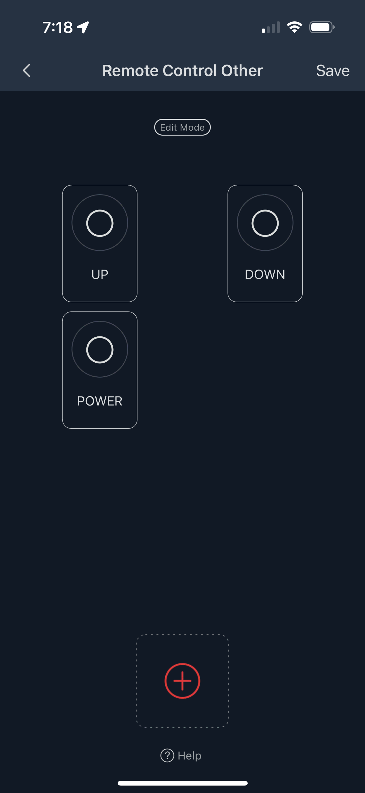
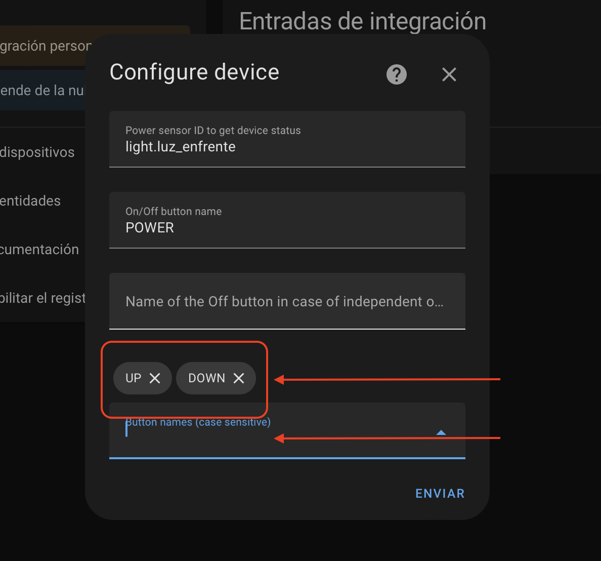

# SwitchBot Remote IR for Home Assistant

An Home Assistant Custom Integration that interact via SwitchBot API to your SwitchBot Hub to control virtual remote IR devices.

Supported device:

* Air Conditionair
	- Custom sensor for power status tracking
	- Custom sensor for temperature status tracking
	- Custom sensor for humidity status tracking
	- On/Off control
	- Min, Max, and Steps settings
	- Temperature control
	- Fan control
	- A/C Modes
* TV | IPTV | Streamer | Set Top Box
	- Custom sensor for power status tracking
	- On/Off control
	- Volume +/- and mute
	- Channel up/down (prev/fowd) 
	- Channel number to source via service
* DVD | Speaker
	- Custom sensor for power status tracking
	- On/Off control
	- Volume +/- and mute
	- Play, Pause, Stop, Prev and Next controls
* Fan
	- Custom sensor for power status tracking
	- On/Off control
	- Buttons ION and TIMER in device settings
	- Fan Speeds (1,2,3)
* Light
	- Custom sensor for power status tracking
	- On/Off control
	- Brightness control (+/-) in device settings
	- Temperature light control (+/-) in device settings
* Air Purifier
	- Custom sensor for power status tracking
	- On/Off control
* Water Heater
	- Custom sensor for power status tracking
	- Custom sensor for temperature status tracking
	- On/Off control
* Vacuum Cleaner
	- Cleaning / Stop command
	- Go to Dock/Charge command
* Camera Shutter
	- Shutter buton
	- Timer buton
	- Menu buton
* Others
	- Custom sensor for power status tracking
	- On/Off control
	- Custom On and Off separated command in device settings

_All above devices support DIY types and add custom buttons/commands in device settings_

To configure custom/learned buttonsmake sure the name of the button must be exactly as they appear in the app (case sensitive and characters like spaces).

## Installation

[HACS](https://hacs.xyz/) > Integrations > Custom Repository > Add this URL <https://github.com/KiraPC/ha-switchbot-remote> as integration > Download it.

Restart Home Assistant

## Configuration

The configuration variables that you need are your Switchbot Token and Secret, follow this [guide](https://github.com/OpenWonderLabs/SwitchBotAPI#getting-started) to get them.
Then configure the integration via UI Config Flow.

## Support

If you like my work you can support me here: https://paypal.me/kirapc or just leaving a star to the repo.
