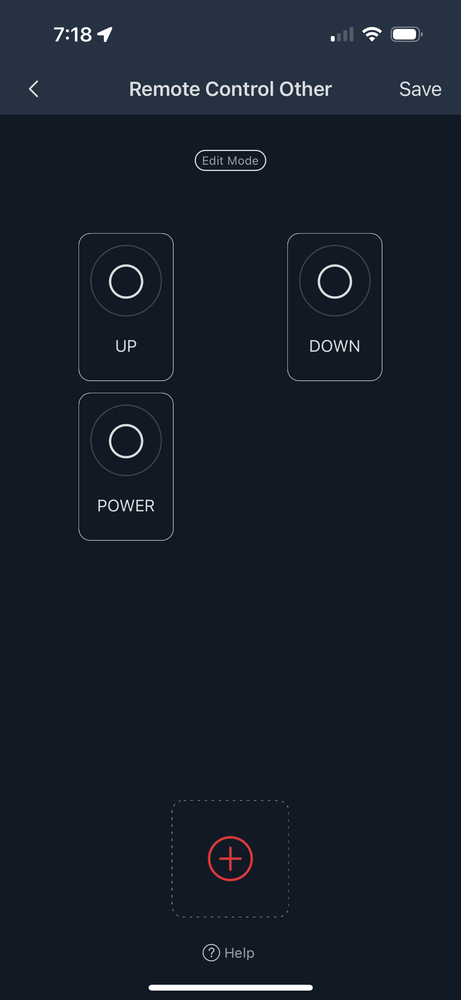
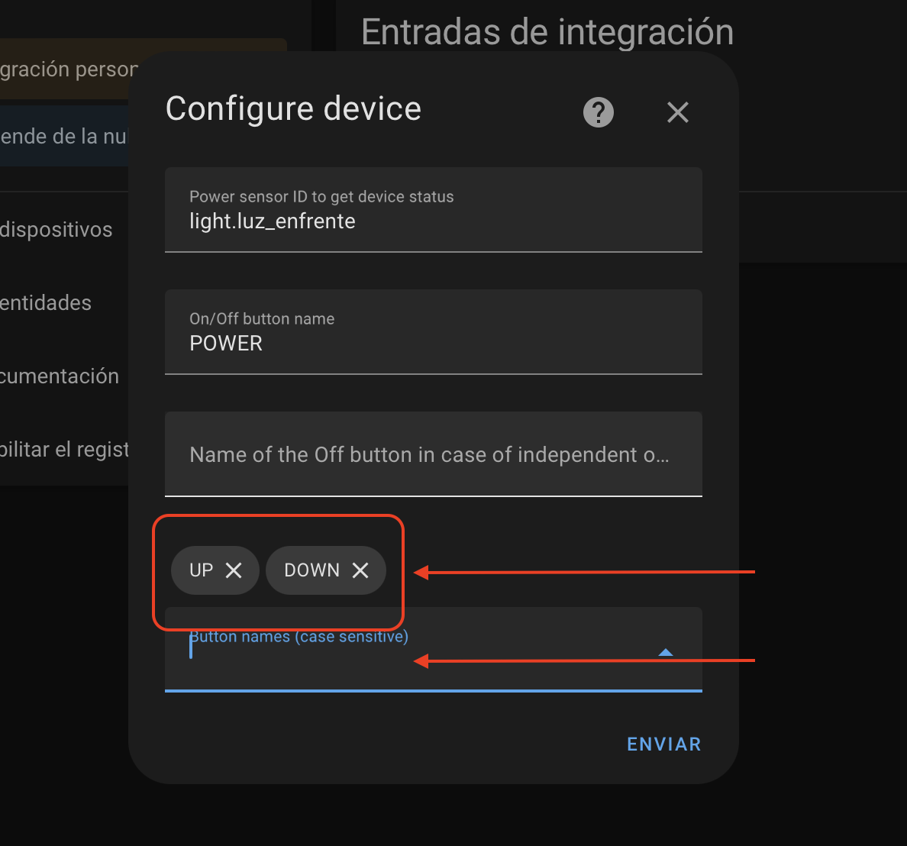

# SwitchBot Remote IR for Home Assistant

An Home Assistant Custom Integration that interact via SwitchBot API to your SwitchBot Hub to control virtual remote IR devices.

Supported device:

* Air Conditionair
	- Custom sensor for power status tracking
	- Custom sensor for temperature status tracking
	- Custom sensor for humidity status tracking
	- On/Off control
	- Min, Max, and Steps settings
	- Temperature control
	- Fan control
	- A/C Modes
* TV | IPTV | Streamer | Set Top Box
	- Custom sensor for power status tracking
	- On/Off control
	- Volume +/- and mute
	- Channel up/down (prev/fowd) 
	- Channel number to source via service
* DVD | Speaker
	- Custom sensor for power status tracking
	- On/Off control
	- Volume +/- and mute
	- Play, Pause, Stop, Prev and Next controls
* Fan
	- Custom sensor for power status tracking
	- On/Off control
	- Buttons ION and TIMER in device settings
	- Fan Speeds (1,2,3)
* Light
	- Custom sensor for power status tracking
	- On/Off control
	- Brightness control (+/-) in device settings
	- Temperature light control (+/-) in device settings
* Air Purifier
	- Custom sensor for power status tracking
	- On/Off control
* Water Heater
	- Custom sensor for power status tracking
	- Custom sensor for temperature status tracking
	- On/Off control
* Vacuum Cleaner
	- Cleaning / Stop command
	- Go to Dock/Charge command
* Camera Shutter
	- Shutter buton
	- Timer buton
	- Menu buton
* Others
	- Custom sensor for power status tracking
	- On/Off control
	- Custom On and Off separated command in device settings

_All above devices support DIY types and add custom buttons/commands in device settings_

### Default Commands for Media Devices

Media devices (TV, IPTV, DVD, Speaker, Projector, Set Top Box) come with a set of default commands that are always available:

**Basic Commands** (automatically included):
- Power control (turn on/off)
- Volume control (up/down, mute)
- Channel/Source control (up/down, set specific channel)
- Playback control (play, pause, stop, next, previous) - *varies by device type*

**Extra Commands** (optional):
In addition to basic commands, each media device type has a collection of extra commands that you can optionally enable during device configuration. These include:
- Navigation buttons (menu, back, select, cursor movements)
- Direct digit selection (0-9)
- Device-specific functions (fast forward, rewind, guides, etc.)

During device setup, you can select which extra commands you'd like to add to your device. This allows you to customize the available buttons to match your specific device and control needs.

To configure custom/learned buttons, make sure the name of the button must be exactly as they appear in the app (case sensitive and characters like spaces).

## Installation

[HACS](https://hacs.xyz/) > Integrations > Custom Repository > Add this URL <https://github.com/KiraPC/ha-switchbot-remote> as integration > Download it.

Restart Home Assistant

## Configuration

The configuration variables that you need are your Switchbot Token and Secret, follow this [guide](https://github.com/OpenWonderLabs/SwitchBotAPI#getting-started) to get them.
Then configure the integration via UI Config Flow.

## Support

If you like my work you can support me here: https://paypal.me/kirapc or just leaving a star to the repo.
